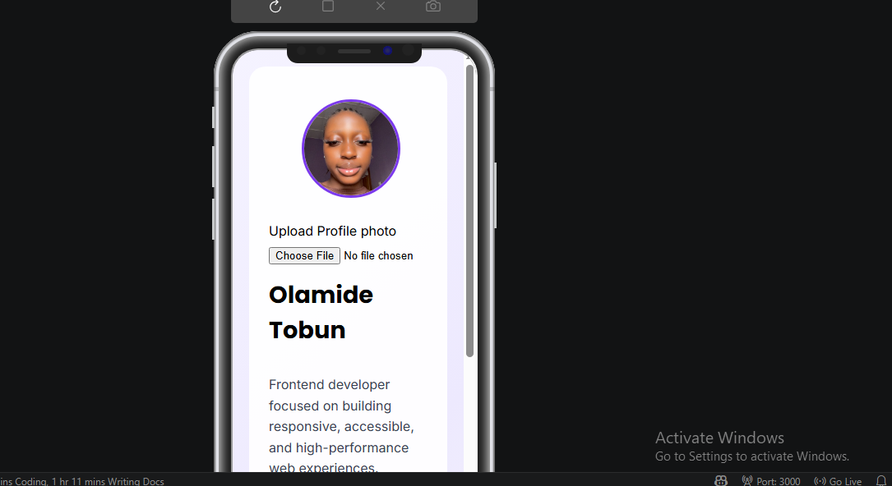
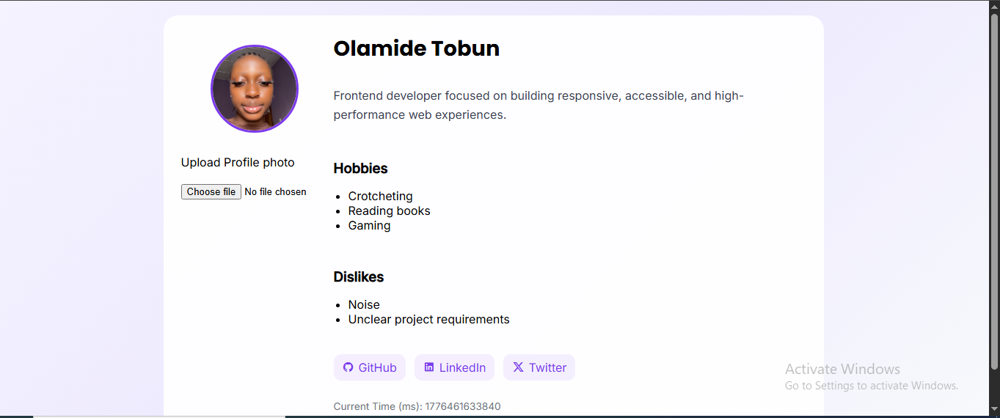

# 👤 Profile Card Component (Stage 1B)

A responsive and accessible profile card built using **HTML, CSS (mobile-first), and vanilla JavaScript**.  
It demonstrates semantic HTML, CSS Grid layout, and dynamic JavaScript updates.

---

## 🚀 Live Demo

👉 Live Site: YOUR_LIVE_URL

---

## 📁 GitHub Repository

👉 Repo: https://github.com/Cryptodoll-sketch/profile-card

---

## 📸 Screenshots

### Mobile View

### Desktop View

---

## ✨ Features

- Mobile-first responsive design
- CSS Grid layout for tablet/desktop
- Profile avatar with image upload support
- Live time display (milliseconds using Date.now())
- Social media links (GitHub, LinkedIn, Twitter)
- Fully semantic HTML structure
- Accessible UI (ARIA + alt text support)
- Keyboard-friendly navigation
- Test-ready with required data-testid attributes

---

## 🧱 Tech Stack

- HTML5
- CSS3 (Flexbox + CSS Grid)
- Vanilla JavaScript

---

## 📦 Project Structure

1B(profile-card)/
│
├── index.html
├── styles.css
├── script.js
├── images/
│   └── Savagehorlamide.jpg
└── screenshots/
    ├── mobile.png
    └── desktop.png

---

## 🖥️ How to Run Locally

### 1. Clone repository
git clone YOUR_GITHUB_REPO

### 2. Navigate into project
cd project-folder

### 3. Open in browser
- Double click index.html  
OR  
- Use VS Code Live Server extension

---

## ⚙️ JavaScript Features

- Displays current epoch time using Date.now()
- Updates every second automatically
- Allows image upload to replace avatar dynamically

---

## 🧪 Testing Notes

This project includes all required test selectors:

- test-profile-card
- test-user-name
- test-user-bio
- test-user-avatar
- test-user-time
- test-user-social-links
- test-user-social-github
- test-user-social-linkedin
- test-user-social-twitter
- test-user-hobbies
- test-user-dislikes

All attributes must remain unchanged for grading compatibility.

---

## 📱 Responsive Behavior

- Mobile: stacked vertical layout
- Tablet/Desktop: CSS Grid layout
  - Avatar on left
  - Content on right
  - Time anchored bottom-left

---

## ♿ Accessibility

- Semantic HTML (article, section, nav, figure)
- Alt text for images
- aria-live for dynamic time updates
- Keyboard navigable links
- Proper label support for file upload

---

## 👨‍💻 Author

Built by Olamide Tobun  
Frontend Developer 

---

## 📌 Notes

- Ensure images are stored in /images folder
- Screenshots must be placed in /screenshots folder
- Use a live server for best experience
- All test IDs are required for validation